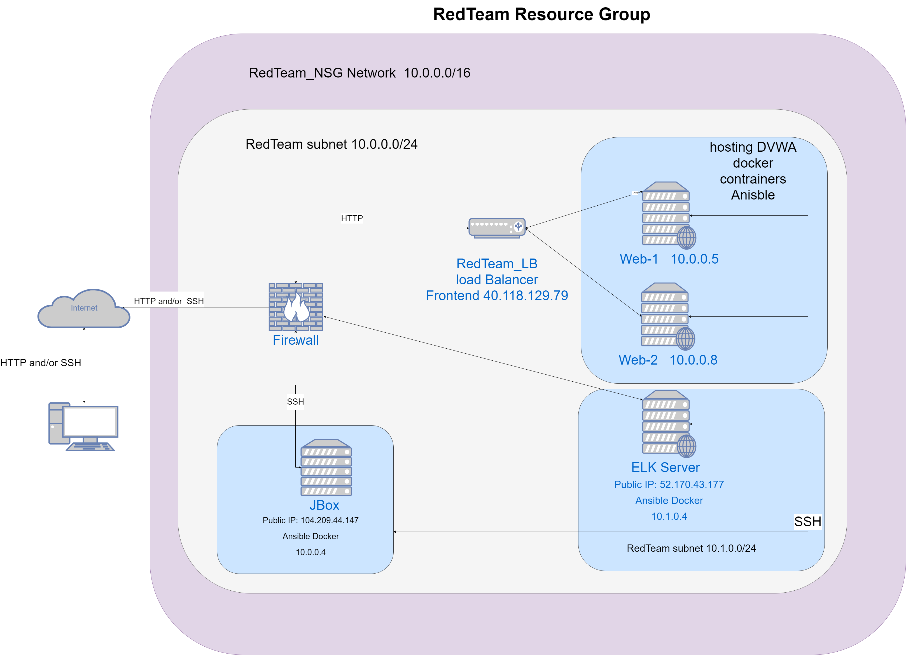
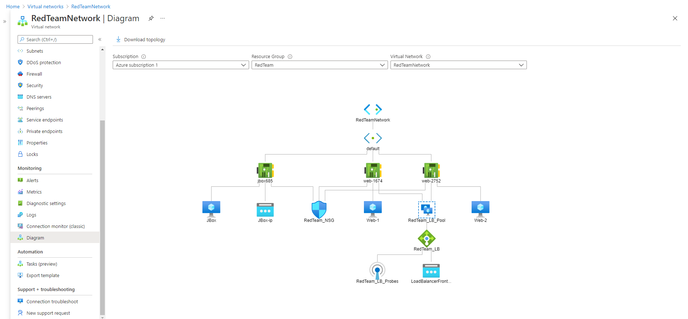
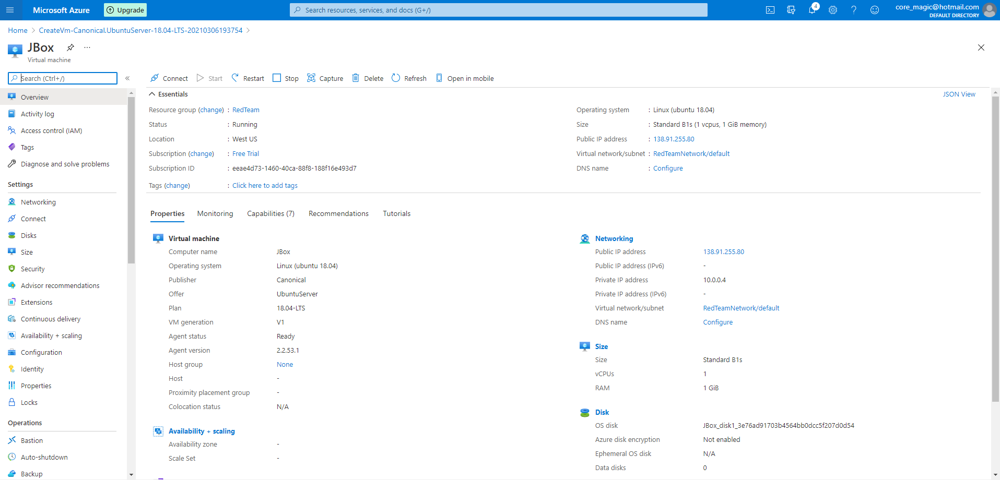
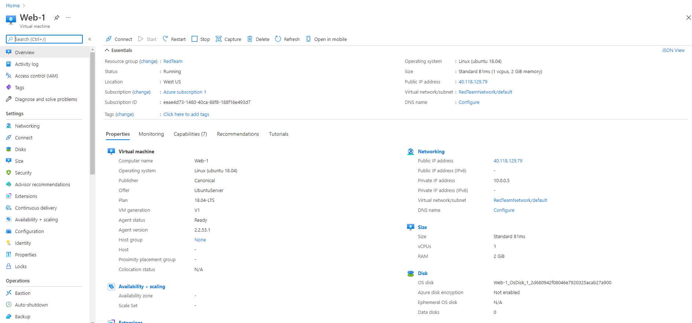
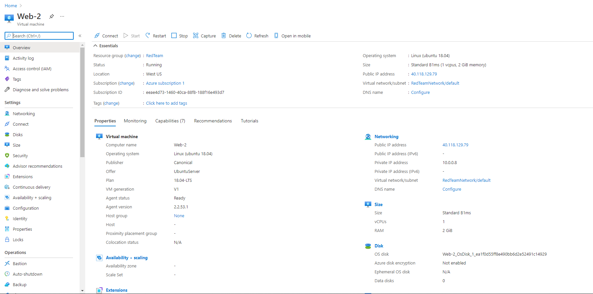
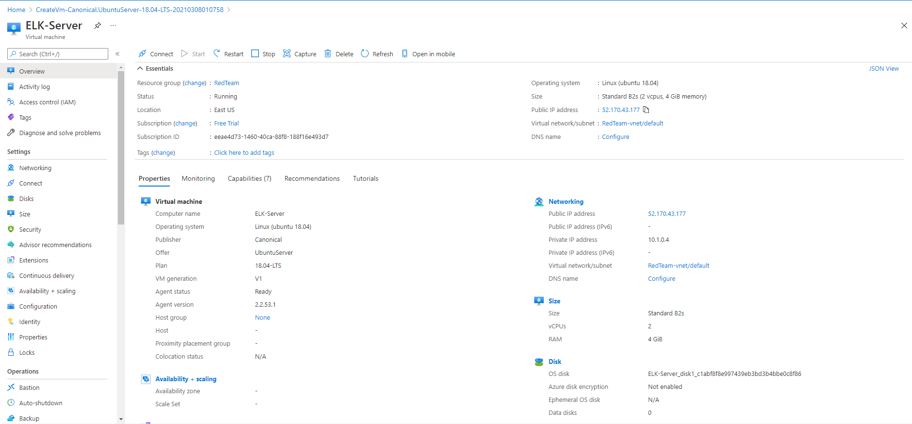
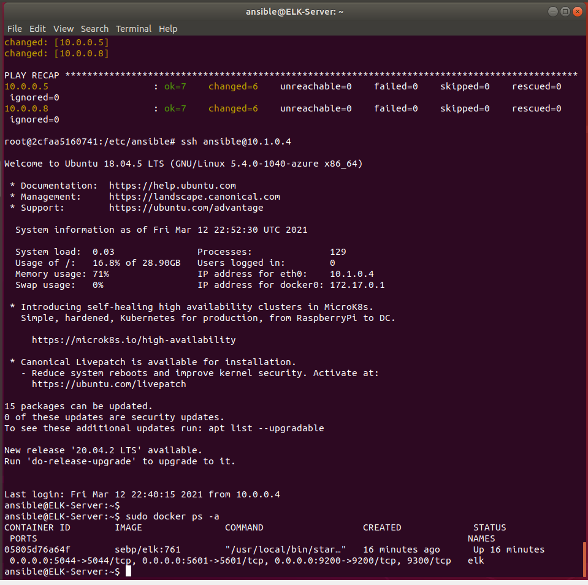

## Automated ELK Stack Deployment

The files in this repository were used to configure the network depicted below.

These files have been tested and used to generate a live ELK deployment on Azure. They can be used to either recreate the entire deployment pictured above. Alternatively, select portions of the yml file may be used to install only certain pieces of it, such as Filebeat.
  
-[Filebeat Configuration File](Files/filebeat-playbook.yml)

-[Metribeat Configuration File](Files/metricbeat-playbook.yml)

This document contains the following details:
- Description of the Topologu
- Access Policies
- ELK Configuration
  - Beats in Use
  - Machines Being Monitored
- How to Use the Ansible Build

### Description of the Topology

The main purpose of this network is to expose a load-balanced and monitored instance of DVWA, the D*mn Vulnerable Web Application.

Load balancing ensures that the application will be highly avaliable, in addition to restricting traffic to the network.
- Load balancing also plays an important security role as computing moves evermore to the cloud. The off-loading function of a load balancer defends an organization against **distributed denial-of-service (DDoS)** attacks. 
A **load balancer** can add additional layers of security to your website without any changes to your application. Protect applications from emerging threats 
- **Jump box** prevents all Azure VM’s to expose to the public. It can be set-up easily using ARM; We can do monitoring and logging on a single box. We can easily turn the ON/OFF remote desktop connectivity feature. By using the network security group, we can restrict the IP addresses to communicate with the Jump box.
- Jump box is used to administrate the RedTeam resources in the Virtual Network "RedTeamNetwork".
- Firewall is created as "RedTeam_NSG" to block the external traffic.

Integrating an ELK server allows users to easily monitor the vulnerable VMs for changes to the files and system usage.
- Filebeat collects data of the file system.
- Metricbeat collects machine metrics and system uptime.

The configuration details of each machine may be found below.
_Note: Use the [Markdown Table Generator](http://www.tablesgenerator.com/markdown_tables) to add/remove values from the table_.

In the first setup:
- Set up 3 virtual machine for web servers: WM1, WM2 and WM3.

| Name          | Function   | IP Address | Operating System |
|---------------|------------|------------|------------------|
| JBox          | Gateway    | 10.0.0.4   |   Linux          |
| Web-1         | Web WM 1   | 10.0.0.5   |   Linux          |
| Web-2         | Web WM 2   | 10.0.0.8   |   Linux          |
| ELK-Server    | ELK Server | 10.1.0.4   |   Linux          |

- Set up RedTeam resoucres as follows:

### Access Policies

The machines on the internal network are not exposed to the public Internet. 

Only the Whitelisted machine can accept connections from the Internet. Access to this machine is only allowed from the following IP addresses: 169.254.224.135

Machines within the network can only be accessed by SSH port.
My persaonl machine with IP 169.254.224.135 allow to access ELK VM.

A summary of the access policies in place can be found in the table below:

| Name          | Publicly Accessible |  Allowed IP Addresses      |   Location         |
|---------------|---------------------|----------------------------|--------------------|
| Jump Box      | Yes                 | 104.209.44.147             |   West US          |
| Web-1         | No                  | Internal SSH port 22       |   West US          |
| Web-2         | No                  | Internal SSH port 22       |   West US          |
| ELK           | Yes                 | 52.170.43.177              |   East US          |
| Load Blancer  | Yes                 | 40.118.129.79              |   West US          |

- Set up RedTeam NSG inbound and outbound security setting.

### Elk Configuration

Ansible was used to automate configuration of the ELK machine. No configuration was performed manually, which is advantageous because...
- configuration with Ansible containerv allows: team shares consistent development environment, reduces development management overhead.

The playbook implements the following tasks:
- Install Docker
- Download application images using docker hub
- Automate application and configuration using playbook *.yml file.  
- [ELK Docker Install File](Files/install-elk.yml)

The following screenshot displays the result of running `docker ps -a` :

### Target Machines & Beats
This ELK server is configured to monitor the following machines:

- Web-1:10.0.0.5

- Web-2:10.0.0.8

We have installed the following Beats on these machines:

- Web-1:10.0.0.5 (Web server A)

- Web-2:10.0.0.8 (Web server B)

These Beats allow us to collect the following information from each machine:

- Filebeat collects data about the file system, and Metricbeat collects machine metrics with uptime status.

- Heartbeat collects and monitors services for their availability.

### Using the Playbook
In order to use the playbook, you will need to have an Ansible control node already configured. Assuming you have such a control node provisioned: 

SSH into the control node and follow the steps below:
- Copy the .yml file to docker.
- Update the hosts file to include the target machines, Web-1, Web-2 and ELK-Server.
- Run the playbook, and navigate to the target machine to check that the installation worked as expected.

URL: http://ELK-Server_Public_IP:5601

The step by step images are captured in the New_images folder.